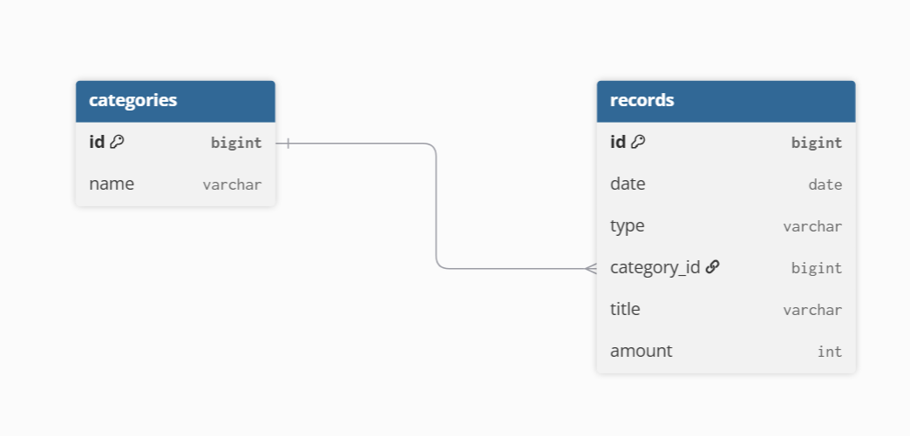

# BudgetBook

수입과 지출을 기록하고, 카테고리별 지출과 월별 통계를 확인할 수 있는 개인 가계부 웹 애플리케이션입니다.

Spring Boot 기반 웹 애플리케이션의 전체 흐름을 직접 구현하며
**Controller - Service - Repository - Database 간 데이터 흐름과 MVC 구조를 학습하는 것**을 목표로 개발했습니다.

---

## 프로젝트 소개

가계부의 기본 기능인 수입·지출 기록을 중심으로 내역 조회, 카테고리 관리, 통계 기능을 구현했습니다.

단순 CRUD 구현에서 끝내지 않고 개발 과정에서 발생한 문제를 수정하면서 Entity와 Form 객체 분리, 입력값 검증, 예외 처리 등 코드 구조도 개선했습니다.

### 주요 기능

* 수입 / 지출 내역 등록
* 수입 / 지출 내역 조회
* 내역 수정 및 삭제
* 카테고리 관리
* 내역 정렬
* 검색 및 필터링

  * 기간
  * 수입 / 지출
  * 카테고리
  * 내역
* 월별 조회
* 이번 달 수입 / 지출 / 잔액 확인
* 카테고리별 지출 통계
* 월별 / 일별 지출 통계

---

## 기술 스택

### Backend

* Java 21
* Spring Boot 4.1.0
* Spring MVC
* Spring Data JPA
* Bean Validation

### Frontend

* Thymeleaf
* HTML
* CSS
* Bootstrap

### Database

* Microsoft SQL Server

### Build / Version Control

* Gradle
* Git
* GitHub

---

## 화면 구성

### 1. 내역 화면

등록한 수입 및 지출 내역을 확인하는 화면입니다.

기간, 수입/지출 여부, 카테고리 등의 조건으로 원하는 내역을 조회할 수 있도록 구성했습니다.

> 추후 화면 이미지 추가

---

### 2. 내역 등록 / 수정

날짜, 수입·지출 구분, 카테고리, 금액, 내용을 입력하여 내역을 등록하거나 수정할 수 있습니다.

잘못된 값이 저장되지 않도록 입력값 검증을 적용했습니다.

> 추후 화면 이미지 추가

---

### 3. 카테고리 관리

수입 및 지출 기록에서 사용하는 카테고리를 관리합니다.

> 추후 화면 이미지 추가

---

### 4. 통계 화면

선택한 월을 기준으로 수입, 지출, 잔액을 확인할 수 있습니다.

또한 카테고리별 지출과 월별·일별 지출 데이터를 조회하여 소비 현황을 확인할 수 있도록 구현했습니다.

> 추후 화면 이미지 추가

---

## ERD



수입·지출 내역과 카테고리 데이터를 관계형 데이터베이스로 관리하도록 설계했습니다.

---

## 프로젝트 구조

```text
Controller
    ↓
Service
    ↓
Repository
    ↓
Database
```

Spring MVC 구조를 기반으로 각 계층의 역할을 분리했습니다.

* **Controller**

  * 사용자의 요청 처리
  * 입력값 전달
  * 화면에 필요한 데이터 전달

* **Service**

  * 비즈니스 로직 처리
  * Controller와 Repository 사이의 데이터 흐름 관리

* **Repository**

  * Spring Data JPA를 이용한 데이터 조회 및 저장
  * 통계 및 검색 조건에 필요한 데이터 조회

* **Thymeleaf**

  * Controller에서 전달받은 데이터를 화면에 출력

---

## 개발 과정에서 개선한 점

프로젝트를 처음 구현한 이후 코드와 동작을 다시 점검하면서 다음과 같은 부분을 개선했습니다.

### 1. Entity와 Form 객체 분리

초기에는 Entity를 화면의 입력값 전달에도 사용하는 구조였습니다.

하지만 Entity가 화면 입력 형식과 직접 연결되면 영속성 객체와 사용자 입력의 책임이 섞인다고 판단했습니다.

따라서 등록 및 수정 시 별도의 Form 객체를 사용하도록 변경하여 화면에서 전달되는 데이터와 DB에서 관리되는 Entity의 역할을 분리했습니다.

---

### 2. 입력값 Validation 적용

사용자가 잘못된 금액이나 필수값이 누락된 데이터를 입력하는 경우를 고려하여 Bean Validation을 적용했습니다.

Controller에서 입력값을 검증하고 검증에 실패한 경우 데이터가 저장되지 않도록 처리했습니다.

---

### 3. 문자열 타입을 Enum으로 변경

수입 / 지출과 같이 정해진 값만 사용할 수 있는 데이터를 단순 문자열로 관리하면 오타나 잘못된 값이 저장될 가능성이 있다고 판단했습니다.

따라서 해당 값을 Enum으로 변경하여 사용할 수 있는 값을 코드 수준에서 제한했습니다.

---

### 4. Optional 처리 개선

Repository의 `findById()` 결과가 존재하지 않는 경우 `null`을 반환하도록 처리했던 부분을 수정했습니다.

데이터가 존재하지 않는 상황을 명확한 예외로 처리하도록 변경하여 이후 코드에서 발생할 수 있는 NullPointerException 가능성을 줄였습니다.

---

### 5. 전역 예외 처리 적용

Controller마다 예외 처리 코드를 반복하지 않도록 전역 예외 처리 방식을 적용했습니다.

예외 처리 책임을 분리하여 Controller가 요청과 응답 처리에 집중할 수 있도록 구조를 개선했습니다.

---

### 6. 금액 처리 방식 개선

가계부에서 금액은 주요 데이터이기 때문에 계산 과정에서 정확하게 처리될 수 있도록 금액 처리 방식을 점검하고 개선했습니다.

통계 조회 시에도 동일한 금액 데이터를 사용하여 수입, 지출, 잔액을 계산하도록 구성했습니다.

---

### 7. 카테고리 삭제 버그 수정

카테고리 삭제 과정에서 삭제 로직이 두 번 실행되는 문제를 확인했습니다.

Controller와 Service의 흐름을 다시 확인하여 중복으로 삭제가 실행되는 부분을 수정했습니다.

이를 통해 단순히 화면 동작만 확인하는 것이 아니라 요청부터 DB까지의 호출 흐름을 추적하는 경험을 할 수 있었습니다.

---

### 8. DB 접속 정보 분리

초기에는 DB 접속에 필요한 정보를 코드 내부에서 관리하고 있었습니다.

Git 저장소에 중요한 설정값이 노출되지 않도록 DB 아이디 및 비밀번호를 소스 코드에서 분리했습니다.

---

## 현재 개선 중인 사항

기본 기능 구현 이후 실제 사용성과 코드 안정성을 높이기 위해 다음 작업을 진행하고 있습니다.

### 사용자 경험

* 데이터가 없을 경우 안내 메시지 표시
* 삭제 전 확인 메시지
* 등록 / 수정 완료 메시지
* 금액 표시 형식 통일
* 금액 단위 `원` 표시
* 입력 실패 시 오류 메시지 개선
* 모바일 화면 대응 확인
* 카테고리 수정 기능 보완

### 테스트

* Service 단위 테스트
* Repository 및 통계 쿼리 테스트
* Validation 및 예외 상황 테스트

---

## 프로젝트를 통해 학습한 점

이번 프로젝트에서는 단순히 기능을 구현하는 것보다 **하나의 요청이 웹 애플리케이션 내부에서 어떻게 처리되는지 이해하는 것**에 중점을 두었습니다.

내역을 등록하거나 조회하는 기능을 구현하면서

```text
사용자 요청
→ Controller
→ Service
→ Repository
→ Database
→ Controller
→ Thymeleaf
→ 사용자 화면
```

으로 이어지는 전체 데이터 흐름을 직접 구현하고 확인할 수 있었습니다.

또한 처음 작성한 코드를 그대로 두지 않고 다시 살펴보면서 Entity/Form 분리, Validation, Enum 적용, 예외 처리 등의 개선을 진행했습니다.

이를 통해 기능 구현뿐 아니라 **각 계층의 책임을 나누고 유지보수하기 좋은 구조를 고민하는 과정이 중요하다는 점**을 배웠습니다.

---

## 향후 개선

* 사용자 경험 개선
* 서비스 및 Repository 테스트 코드 추가
* 예외 상황 테스트 보강
* 모바일 화면 최적화

---

## 개발자

개인 프로젝트
